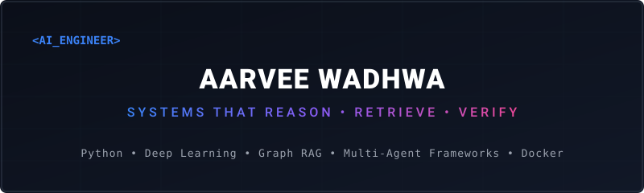

<div align="center">
  
</div>

<br />

<div align="center">
  <a href="https://linkedin.com/in/aarveewadhwa"></a>
  <a href="mailto:aarvee.wadhwa123@gmail.com"></a>
  <a href="https://leetcode.com/u/RVWadhwa/"></a>
</div>

### 🎯 Engineering Philosophy
I engineer scalable **Artificial Intelligence systems** that translate unstructured, multimodal data into reliable decisions, structural evidence, and human-centric interactions. Moving beyond generic wrappers, my focus centers on multi-agent architectures, dynamic knowledge graphs, and late-fusion multimodal ensembles.

---

### 🛠️ Core Technical Arsenal

| Layer | Technologies & Frameworks |
| :--- | :--- |
| **Artificial Intelligence / ML** | PyTorch, TensorFlow, HuggingFace, Transformers (BERT, RoBERTa), Deep Learning, CNNs, BiLSTM, Tokenizers |
| **GenAI / Agentic Frameworks** | LangChain, Llama 3.1, Retrieval-Augmented Generation (RAG), Multi-Agent Coordination |
| **Computer Vision & Audio** | Stable Diffusion, Whisper ASR, ArcFace, RetinaFace, 3DDFA, Swin Transformer, Wav2Vec2, OpenCV |
| **Data & Core Infrastructure** | Python, Neo4j (Graph DB), FastAPI, React, Docker, SQL, NumPy, Pandas, Scikit-learn |

---

### 🚀 Featured Production Systems

#### 📂 1. TruthGraph | Multi-Agent Fact Verification Framework
* **Core Function**: Evaluates complex factual assertions against live evidence graphs to label claims as *Supported*, *Contradicted*, or *Unverifiable*.
* **Architecture Highlight**: Engineered a **Dynamic Evidence Graph in Neo4j** using programmatic claim-evidence nodes. Developed **Consensus-Weighted Confidence Propagation (CWCP)** to score source credibility, semantic weight, and multi-agent agreement into a single verifiable path.
* **Stack**: Python, LangChain, Llama 3.1, Neo4j, FastAPI, React, Docker

```
[User Claim] ──> [Multi-Agent Retrieval] ──> [Neo4j Evidence Graph] ──> [CWCP Engine] ──> [Auditable Verdict]
```

#### 📂 2. Identif.ai | Multimodal Forensic Reconstruction Pipeline
* **Core Function**: Automated investigative pipeline that maps subjective, verbal eyewitness accounts into structured 3D facial metrics.
* **Architecture Highlight**: Chained **Whisper ASR** with **spaCy** to parse structural descriptive features. Fed extracted embeddings into **Stable Diffusion** and fine-tuned matching meshes using **RetinaFace** and **3DDFA** for 3D topology reconstruction.
* **Stack**: Python, Whisper ASR, spaCy, Stable Diffusion, ArcFace, RetinaFace, 3DDFA

#### 📂 3. Joy | Multimodal Empathetic Virtual Therapist
* **Core Function**: Real-time affective agent designed to extract localized mental health markers across complex user expressions.
* **Architecture Highlight**: Built a high-performance **Late Fusion Ensemble** that aggregates hidden states across three processing backends simultaneously: **RoBERTa** (text tokens), **Wav2Vec2** (acoustic arrays), and **Swin Transformer** (facial video tensors).
* **Stack**: Python, RoBERTa, Wav2Vec2, Swin Transformer, PyTorch

---

### 📊 Engineering Metrics & Activity

<div align="center">
  <table border="0">
    <tr>
      <td width="50%" align="center">
        
      </td>
      <td width="50%" align="center">
        
      </td>
    </tr>
  </table>
</div>

---

### 🏛️ Leadership & Community
* **AI Coordinator** @ Google Developer Student Clubs (GDSC) — Led deep-learning workshops and architectural reviews.
* **Programming Member** @ Codex — Mentored engineering peers in data structures, algorithms, and technical compilation.
