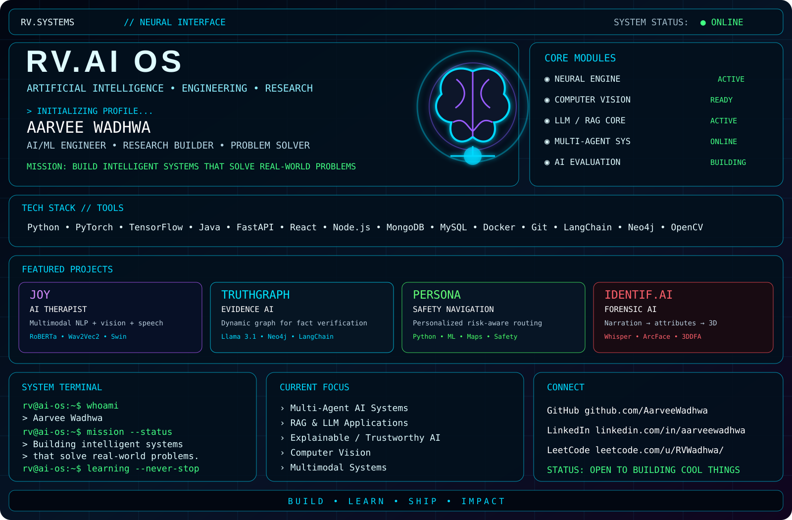

<div align="center">



<br><br>

<a href="https://www.linkedin.com/in/aarveewadhwa">

</a>

<a href="https://leetcode.com/u/RVWadhwa/">

</a>

<a href="https://github.com/AarveeWadhwa">

</a>

</div>

<br>

---

<div align="center">

### `// LIVE PROFILE`

</div>

<table align="center">
<tr>

<td align="center" width="33%">

### ⚡ GITHUB


<br><br>


<br><br>

<a href="https://github.com/AarveeWadhwa?tab=repositories">

</a>

</td>

<td align="center" width="34%">

### 🧩 LEETCODE

<a href="https://leetcode.com/u/RVWadhwa/">


</a>

<br>

<a href="https://leetcode.com/u/RVWadhwa/">

</a>

</td>

<td align="center" width="33%">

### 🟢 STATUS

```text
AI / ML          ONLINE
RAG              BUILDING
LLM              ACTIVE
MULTI-AGENT      BUILDING
COMPUTER VISION  ACTIVE
RESEARCH         ACTIVE
